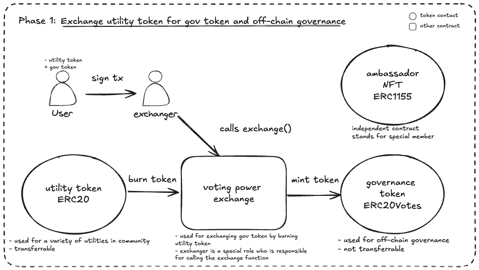
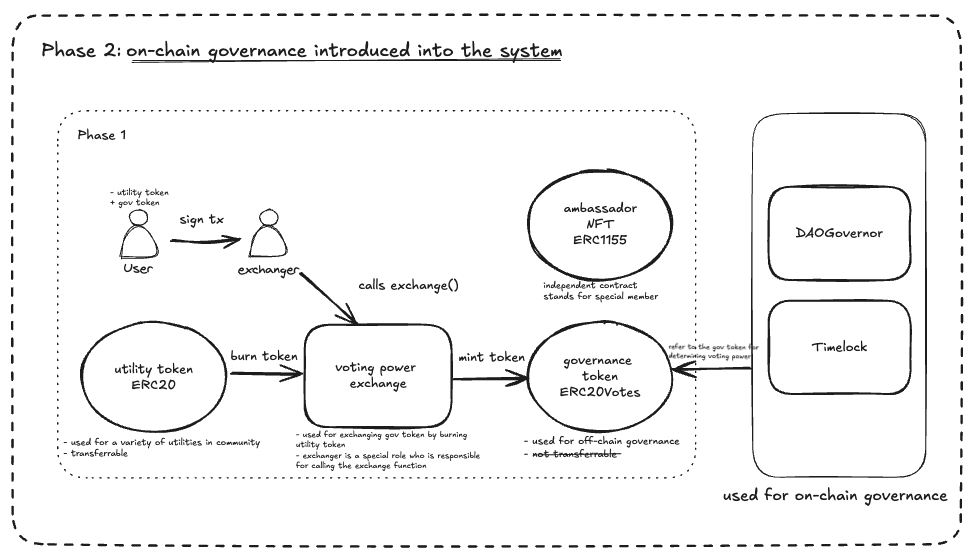

# Smart Contracts for DAO community

This is a repository for the smart contracts of the DAO community. The smart contracts are written in Solidity and tested using the Foundry testing framework.

## Introduction

This is a repository for the smart contracts of the DAO community governance, which is some basic tools for the community.
There are separated tools for the community governance. It will be explained here based on the smart contracts.

All the contracts are sitting in the `src/` folder. These are the core contracts of the protocol.

This repository consists of the following smart contracts:

- AmbassadorNft.sol
  - The smart contract for the NFT that represents the membership of the community.
  - This smart contract is independent from the other smart contracts.
  - The contract is based on the ERC1155 contract of the OpenZeppelin.
- ERC20UpgradeableTokenV1.sol
  - The smart contract for the ERC20 token that is used to represent the utility token of the community.
  - Its use case is to be exchanged for the governance token of the community.
  - Other use cases are possible and it is remained to be defined by the community.
  - The contract is based on the ERC20Upgradeable contract of the OpenZeppelin.
- GovToken.sol
  - The smart contract functioning as the governance token of the community.
  - The token is used to represent the voting power of the holder which is not transferable.
  - The contract is based on the ERC20Votes contract of the OpenZeppelin.
- VotingPowerExchange.sol
  - The smart contract for the voting power exchange of the community.
  - The contract is used to get the governance token by burning the utility token the user holds.
  - This contract is created from scratch.
- MyGovernor.sol
  - The smart contract for the DAO governance of the community.
  - The contract is used to manage the proposal of the community in a more decentralized manner.
  - The contract is based on the Governor contract of the OpenZeppelin.
- Timelock.sol
  - The smart contract for the timelock of the community.
  - This contract will become the owner of the MyGovernor contract.

## Roles

The system is managed by different roles. The roles are managed by the default admin role.

- DEFAULT_ADMIN_ROLE: The default admin role is the owner of the contract.
  - This is the highest authority role in the contract.
  - Responsibilities: Has the power to manage all other roles.
  - Functions: Can grant and revoke all other roles.
- MANAGER_ROLE:
  - Responsibilities: Can manage the contract and call some special functions.
  - Functions: `setVotingPowerCap()`
- EXCHANGER_ROLE: Exchanger role is the role that can exchange the governance token for the utility token.
  - Responsibilities: Can exchange the governance token for the utility token.
  - Functions: `exchange()`
- MINTER_ROLE: The minter role is the role that can mint new tokens.
  - Responsibilities: Can mint new tokens for the ambassador NFT, the utility token and the governance token.
  - Functions: `mint()`, `mintBatch()`
- BURNER_ROLE: The burner role is the role that can burn the tokens for the ambassador NFT, the utility token and the governance token.
  - Responsibilities: Can burn the tokens.
  - Functions: `burn()`, `burnBatch()`,`burnByBurner()`
- URI_SETTER_ROLE: The URI setter role is the role that can set the URI of the token.
  - Responsibilities: Can set the URI of the token.
  - Functions: `setURI()`
- UPGRADER_ROLE: The upgrader role is the role that can upgrade the contract.
  - Responsibilities: Can upgrade the contract.
  - Functions: `upgradeToAndCall()`

## Smart Contracts

### `AmbassadorNft.sol`

This is the smart contract for the NFT that represents the membership of the community. I will give some explanation for the possible use cases and the functions of the NFT.

#### Possible use cases and functions explanation

The NFT can be used to represent the membership of the community. For example, membership of A can be represented by NFT1155's id 0 and membership of B can be represented by NFT1155's id 1. Anyone who holds the NFT can be considered as the member of the community.

The default admin role has the right to set the minter and the burner role. The minter role is the role that can mint new tokens. The burner role is the role that can burn the tokens from the specified account.

There are functions to batch mint and batch burn the NFTs. With these functions, the minter and burner roles can easily mint and burn the NFTs for the members.

And the URI of the NFT can be set by the URI setter role after the deployment of the contract.

### `ERC20UpgradeableTokenV1.sol`

This is the smart contract for the ERC20 token that is used to represent the utility token of the community. This utility token is transferable.

#### Use cases and functions explanation

This token is used as the utility token for the community, which can be earned by doing missions or other activities for the community. The users can use utility token to exchange the governance token.

The default admin role has the right to set the minter and the burner role. The minter role is the role that can mint new tokens. The burner role is the role that can burn the tokens from the specified account.

The contract itself is pausable. The pauser role is the role that can pause and unpause the contract. When the contract is paused, the minting and transferring of the token are disabled.

#### Notes

- The contract is upgradable, pausable, and ERC20Permit compliant.

### `GovToken.sol`

This is the smart contract for the governance token of the community. The contract is based on the ERC20Votes contract of the OpenZeppelin. The contract also records the amount of utility token that one holder has burned.

Only the voting power exchange contract has the right to update the amount of utility token that one holder has burned.

#### Use cases and functions explanation

The token is used to represent the voting power of the holder. The token is not transferable. At the same time, it is also used to represent the level of the holder, e.g. the higher the level, the more voting power the holder has.
For example, holding 1 token means the holder is level 2. Holding 0 token means the holder is level 1.

The token is not transferable. It means the token holder cannot transfer the token to any other address.

ERC20Permit is inherited here because OpenZeppelin's wizard is doing so and we followed its code, which is a relatively secure way in our opinion.

#### Notes

There are 2 phases when we want to utilize this token in the protocol. After kicking off as Phase 1, the community governance will be under observation. When phase 1 is stable and mature, we will transition into phase 2 gradually in the future.

- Phase 1:
  We use the token to represent the voting power of the holder. And manage governance off-chain using the token balance of the governance participants.

<div style="text-align: center;">
  
</div>

- Phase 2:
  We use the token to represent the voting power, i.e. level, of the holder. And manage governance on-chain using the token balance of the governance participants.

<div style="text-align: center;">
  
</div>

The GovToken is in a sense an achievement recorder. We want to make sure the achievement system is transparent and verifiable for all participants. That is why we did not make this token upgradable.

In fact, voting units in the token must be delegated to someone to be counted as actual voting power. The reason is mentioned in the documentation of OpenZeppelin contract.

> In fact, voting units _must_ be delegated in order to count as actual votes, and an account has to
> delegate those votes to itself if it wishes to participate in decisions and does not have a trusted representative.

### `VotingPowerExchange.sol`

This contract is used to exchange the utility token for the governance token. The exchange is done by burning the governance token and minting the utility token.

The voting power exchange contract is the minter of the governance token and the burner of the utility token.

#### Use cases and functions explanation

The contract has several functions to calculate the amount governance token the holder deserve to get by burning the utility token that he has.

The main function is `exchange()`. It is the function that can only be called by the exchanger role.
Exchanger role is the role that supposed to be managed by the protocol owner.

The function first checks the validity of the input which includes the sender's signature. The signature is generated off-chain and it can only be generated by the sender himself.

This makes sure that the sender himself has the intention to exchange such amount of token. In this way, we want to prevent the case that the exchanger role is abused.

Furthermore, the function checks the nonce and the expiration of the signature to make sure that the signature is fresh and valid.

Then it calculates the amount of the governance token that the holder deserve to get.

The calculation is based on the mathematical formula in the _References_ section.

The contract sets a cap for the amount of the governance token that the holder can get.

If someone is below the cap and has the utility token to exchange more than the cap, the function will only exchange the amount of the token that the cap allows.

If someone has already reached the cap, the function will not allow the exchange.

No one is allowed to get more voting power than the cap.

After the calculation, the function will mint the governance token to the holder and burn the utility token from the holder.

The function also updates the amount of the utility token that the holder has burned in the GovToken contract.

#### Notes

- The contract is created from scratch.
- There are some variables which are used to for the precision of the calculation.
- `SafeERC20` is not used because the token contract we are using is known to be safe.

### `MyGovernor.sol`

This is the smart contract for the DAO governance of the community. The contract is based on the Governor contract of OpenZeppelin.

This contract will be used in the Phase 2 of the community governance.

#### Use cases and functions explanation

- Basic governor functionality (proposal creation, voting, execution)
- Configurable governance settings (voting delay, voting period, proposal threshold)
- Integration with an ERC20Votes token for voting power
- Quorum requirements based on a fraction of total supply
- Timelock integration for delayed execution

Key features and parameters:

- Voting delay: 1 day (time between proposal creation and voting start)
  - can be changed later
- Voting period: 1 week (duration of the voting phase)
  - can be changed later
- Proposal threshold: 1e18 tokens (minimum tokens required to create a proposal)
  - can be changed later
- Quorum: 1% of total token supply (minimum participation for a valid vote)

#### Notes

- The contract is designed to work with a specific ERC20Votes token (likely the GovToken mentioned earlier) and a TimelockController.
- Some parameters (voting delay, voting period, proposal threshold, quorum) are hardcoded in the constructor for the set up when the contract is deployed.
- The contract uses OpenZeppelin's latest contracts (v5.0.0), ensuring up-to-date security features and best practices.
- This contract is supposed to be used when the community governance is ready to be fully decentralized in the phase 2 of the community governance.

### `Timelock.sol`

The `Timelock.sol` contract is a time-lock controller based on OpenZeppelin's `TimelockController`.

This contract will be used in the Phase 2 of the community governance.

#### Use cases and functions explanation

Its main purposes and functionalities include:

1. Delayed Execution: Provides a mandatory waiting period for passed proposals, enhancing governance security.
2. Access Control: Manages which addresses can propose, execute, or cancel operations. If address(0) is set as the proposer or executor, then anyone can propose or execute.
3. Transparency: All pending operations are publicly viewable, giving community members time to review and react.

When the proposal is passed in the DaoGovernor, it will be queued in the timelock. After a predetermined delay, the actual execution is done by the timelock.

#### Notes

- The contract's admin role is set in the beginning and it is recommended to be revoked later.
- We suppose the executor role can be set as address(0) in the beginning which means anyone can execute. And the proposer role is set as the governor contract in the beginning. It means the governor contract only has the right to propose.
- Why we need to grant the timelock the minter role to mint gov token in the test case:
  - When the proposal is passed, the queue operation will be called and the actual called function of timelock is `scheduledBatch()`. After that, the DaoGovernor's `execute()` function can be called by anyone to execute the proposal. And this function will call the timelock's `executeBatch()` function to execute the proposal. The real executor is the timelock.

#### Governance flow

As the code is written in the test case of using the governance to mint some gov token to user A, the flow of the governance is as follows:

Preparation:

- User A has some voting power.

1. Prepare the values, targets, calldatas, and description of the proposal.
2. After a while, User A creates the proposal: `daoGovernor.propose()`.
3. Some users cast votes for the proposal: `daoGovernor.castVote()`.
4. The proposal is queued in the timelock: `daoGovernor.queue()`.
5. After the delay, anyone can call this function: `daoGovernor.execute()`.
6. The token is minted to User A.

## About auditing

### Scope

- src/
  - AmbassadorNft.sol
  - ERC20UpgradeableTokenV1.sol
  - GovToken.sol
  - VotingPowerExchange.sol
  - MyGovernor.sol
  - Timelock.sol

### Out of Scope

Any file except for the files in the above Scope.

### Known issues

- Two step ownership transfer process is a known issue. We accept the risk of it.
- The precision loss in the calculation of the voting power and the burned token is existing but the precision loss will not be a problem because the value loss caused by it is very small, e.g. 1e9 token. It is ignorable.

### Some notes

- Because we are using a mathematical formula(mentioned in the _Reference_ section) which including square root calculation, some precision loss happens in the calculation. e.g. if we exchange 1e9 utility token for the governance token theoretically, what we get is zero token. Because of that, we made the value of the utility token to be 1e18 at least if someone wants to call the `exchange` function.
- Maybe the tests, also fuzz tests, are not able to cover all the edge cases. if you find any issues, please let us know.

## Tests

The tests are written in the `test/` directory. And it consists of the following tests:

- unit tests: `test/unit/`
- integration tests: `test/integration/`
- fuzz tests: `test/fuzz/`

More information about the tests is written in the `test/readme.md`. Please refer to it for more details about the tests.

## How to Start

1. Clone the repository

```shell
git clone https://github.com/codefox-inc/dao-community-contracts.git
```

2. Update the foundry dependencies by running

```shell
foundryup
```

3. Install the dependencies by running

```shell
make install
```

4. Compile the contracts by running

```shell
forge compile
```

5. Run the test by running

```shell
make test
```

6. Run the coverage by running

```shell
make coverage
```

## References

### Mathematical Formula and tables

These are the values we used in the exchange function and tests for voting power <-> burned token calculation.

```
x = (2 \* sqrt(306.25 + 30y) - 5) / 30 - 1
y = (15*x^2+35*x)/2

x: mintedToken
y: burnedToken
```

| Minted Token (lvl) | Level | Burned Token |
| ------------------ | ----- | ------------ |
| 0                  | 1     | 0            |
| 1                  | 2     | 25           |
| 2                  | 3     | 65           |
| 3                  | 4     | 120          |
| 4                  | 5     | 190          |
| 5                  | 6     | 275          |
| 6                  | 7     | 375          |
| 7                  | 8     | 490          |
| 8                  | 9     | 620          |
| 9                  | 10    | 765          |
| 10                 | 11    | 925          |
| 11                 | 12    | 1100         |
| 12                 | 13    | 1290         |
| 13                 | 14    | 1495         |
| 14                 | 15    | 1715         |
| 15                 | 16    | 1950         |
| 16                 | 17    | 2200         |
| 17                 | 18    | 2465         |
| 18                 | 19    | 2745         |
| 19                 | 20    | 3040         |
| 20                 | 21    | 3350         |
| 21                 | 22    | 3675         |
| 22                 | 23    | 4015         |
| 23                 | 24    | 4370         |
| 24                 | 25    | 4740         |
| 25                 | 26    | 5125         |
| 26                 | 27    | 5525         |
| 27                 | 28    | 5940         |
| 28                 | 29    | 6370         |
| 29                 | 30    | 6815         |
| 30                 | 31    | 7275         |
| 31                 | 32    | 7750         |
| 32                 | 33    | 8240         |
| 33                 | 34    | 8745         |
| 34                 | 35    | 9265         |
| 35                 | 36    | 9800         |
| 36                 | 37    | 10350        |
| 37                 | 38    | 10915        |
| 38                 | 39    | 11495        |
| 39                 | 40    | 12090        |
| 40                 | 41    | 12700        |
| 41                 | 42    | 13325        |
| 42                 | 43    | 13965        |
| 43                 | 44    | 14620        |
| 44                 | 45    | 15290        |
| 45                 | 46    | 15975        |
| 46                 | 47    | 16675        |
| 47                 | 48    | 17390        |
| 48                 | 49    | 18120        |
| 49                 | 50    | 18865        |
| 50                 | 51    | 19625        |
| 51                 | 52    | 20400        |
| 52                 | 53    | 21190        |
| 53                 | 54    | 21995        |
| 54                 | 55    | 22815        |
| 55                 | 56    | 23650        |
| 56                 | 57    | 24500        |
| 57                 | 58    | 25365        |
| 58                 | 59    | 26245        |
| 59                 | 60    | 27140        |
| 60                 | 61    | 28050        |
| 61                 | 62    | 28975        |
| 62                 | 63    | 29915        |
| 63                 | 64    | 30870        |
| 64                 | 65    | 31840        |
| 65                 | 66    | 32825        |
| 66                 | 67    | 33825        |
| 67                 | 68    | 34840        |
| 68                 | 69    | 35870        |
| 69                 | 70    | 36915        |
| 70                 | 71    | 37975        |
| 71                 | 72    | 39050        |
| 72                 | 73    | 40140        |
| 73                 | 74    | 41245        |
| 74                 | 75    | 42365        |
| 75                 | 76    | 43500        |
| 76                 | 77    | 44650        |
| 77                 | 78    | 45815        |
| 78                 | 79    | 46995        |
| 79                 | 80    | 48190        |
| 80                 | 81    | 49400        |
| 81                 | 82    | 50625        |
| 82                 | 83    | 51865        |
| 83                 | 84    | 53120        |
| 84                 | 85    | 54390        |
| 85                 | 86    | 55675        |
| 86                 | 87    | 56975        |
| 87                 | 88    | 58290        |
| 88                 | 89    | 59620        |
| 89                 | 90    | 60965        |
| 90                 | 91    | 62325        |
| 91                 | 92    | 63700        |
| 92                 | 93    | 65090        |
| 93                 | 94    | 66495        |
| 94                 | 95    | 67915        |
| 95                 | 96    | 69350        |
| 96                 | 97    | 70800        |
| 97                 | 98    | 72265        |
| 98                 | 99    | 73745        |
| 99                 | 100   | 75240        |
| 100                | 101   | 76750        |
| 101                | 102   | 78275        |
| 102                | 103   | 79815        |
| 103                | 104   | 81370        |
| 104                | 105   | 82940        |
| 105                | 106   | 84525        |
| 106                | 107   | 86125        |
| 107                | 108   | 87740        |
| 108                | 109   | 89370        |
| 109                | 110   | 91015        |
| 110                | 111   | 92675        |

....

### Documents

- [Foundry Book](https://book.getfoundry.sh/)
- [OpenZeppelin](https://docs.openzeppelin.com/)
